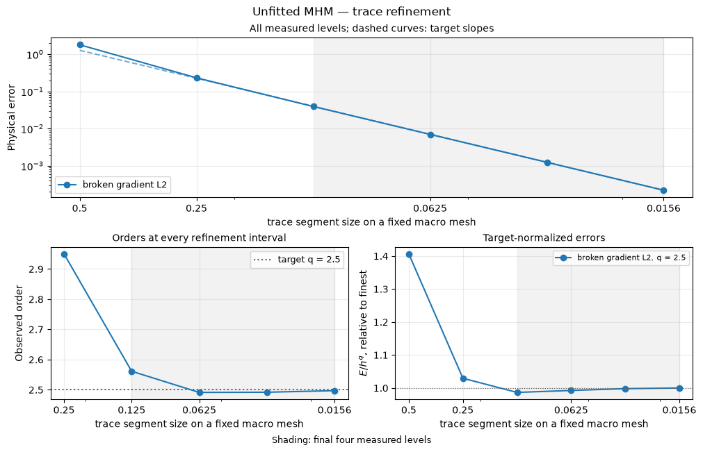

# Unfitted MHM: independent skeletal partitions

[Open the step-by-step notebook](https://github.com/ipes-lncc/pymhm/blob/main/notebooks/darcy/unfitted_trace_workflow.ipynb) · [Download notebook](https://raw.githubusercontent.com/ipes-lncc/pymhm/main/notebooks/darcy/unfitted_trace_workflow.ipynb) · [Theory and degree conditions](../../theory/alternatives.md)

An unfitted trace partition can cut across the local boundary elements. It is declared independently rather than forcing its breaks to coincide with the fine mesh. We first show this geometric capability on smooth identity diffusion with an exact pressure, then distinguish its qualified convergence study from material-interface cases.

The flux-approximation theorem and trace construction follow [Chaumont-Frelet, Paredes and Valentin (2026)](https://doi.org/10.1016/j.camwa.2026.01.016). This smooth example is not a reproduction of their heterogeneous applications.


```python
import numpy as np
import matplotlib.pyplot as plt
import ufl
from pymhm import (
    Equation, FaceSpace, LocalContext, MeshHierarchy, SkeletonSpace, TriangleMesh,
    assemble, bind_interface, bind_problem, columns, solve,
)
from threadpoolctl import threadpool_limits


def exact_pressure(points: np.ndarray) -> np.ndarray:
    """Analytical pressure; it vanishes on every exterior edge."""
    return np.sin(2 * np.pi * points[:, 0]) * np.sin(2 * np.pi * points[:, 1])


def exact_gradient(points: np.ndarray) -> np.ndarray:
    """Independently differentiated physical pressure gradient."""
    x, y = 2 * np.pi * points.T
    return 2 * np.pi * np.column_stack((np.cos(x) * np.sin(y), np.sin(x) * np.cos(y)))


def source(points: np.ndarray) -> np.ndarray:
    """Negative Laplacian computed independently of the discrete operator."""
    return 8 * np.pi**2 * exact_pressure(points)
from pymhm.fem.scalar.triangle import scalar_operators, trace_coupling
from pymhm.postprocessing.nodal import nodal_field

```

## 1. Define macro, local and interface spaces

The hierarchy owns mesh association. The interface binding owns geometric incidence and numbering; variational signs are declared separately.


```python
macro = TriangleMesh.unit_square(2)
local_meshes = tuple(macro.submesh(cell, 4) for cell in range(len(macro.cells)))
hierarchy = MeshHierarchy(macro, local_meshes)
skeleton = SkeletonSpace(macro, tuple(FaceSpace.uniform(1, subdivisions=3) for _ in macro.faces))
interface = bind_interface(skeleton, convention="normal")
```

## 2. Write the local primal form


$$
(\nabla p_T,\nabla v)_T+\langle\lambda_T,v\rangle_{\partial T}=(f,v)_T.
$$


Each macroedge has three P1 trace segments; each local edge has four fine subdivisions with P3 volume pressure. Their partitions differ. The portable Basix owner `scalar_operators` integrates the declared volume form; `trace_coupling` integrates on the common intersections and applies canonical incidence. Its global coordinates are declared explicitly. The UFL volume integrand would be `ufl.inner(ufl.grad(p), ufl.grad(v)) * dx`; native `trace_pairings` currently requires boundary facets aligned with trace breaks, so it is not used for this independent partition. The constant kernel and physical volume moment remain explicit.


```python
def local_equations(local: LocalContext):
    """Declare volume diffusion, physical mean and signed scalar trace forms."""
    fine = local.mesh
    A, mass, force = scalar_operators(fine, 3, diffusion=1.0, source=source, order=12)
    B = trace_coupling(macro, local.cell, fine, skeleton, 3)
    constant = np.ones((A.shape[0], 1))
    field = nodal_field("pressure", fine, 3)
    local.field("pressure", evaluator=field.evaluator,
                gradient_evaluator=field.gradient_evaluator, basis_id=field.basis_id)
    return local.equations(a=A, L=force, b=B, c=-B.T,
                          kernel=constant, moments=mass @ constant,
                          coordinates="global", metadata=(fine,))
```

## 3. State global pressure continuity


$$
-\sum_T\langle p_T,\mu_T\rangle_{\partial T}=-\langle p_D,\mu\rangle_{\partial\Omega}.
$$


Retain one physical pressure mean per macrocell. A material-interface study additionally specifies region markers, each region's coefficient, physical continuity and certified bounds. A trace partition by itself does not supply those data.


```python
def global_equation(global_context):
    """Supply the weak Dirichlet moments in the bound interface layout."""
    boundary, fixed = global_context.boundary_data(0.0, order=8)
    assert not fixed
    return Equation(0, global_context.trace_load(-boundary))


problem = bind_problem(hierarchy, interface, local_equations,
                       global_equation=global_equation, retained=1)
```

## 4. Assemble and solve

Assembly solves the independent local equations and sums their interface contributions. Solving reconstructs named local fields in their executed coefficient bases.


```python
with threadpool_limits(1):
    system = assemble(problem)
    coefficients = solve(system)
pressure_fields = coefficients.field("pressure")
```

## 5. Integrate physical errors

Pressure and its broken gradient are integrated separately with positive order-12 quadrature. No algebraic residual is used as a substitute for these errors.


```python
from pymhm.fem.scalar.operators import triangle_quadrature
bary, weights = triangle_quadrature(12)
pressure_error, gradient_error = 0.0, 0.0
for fine, field in zip(local_meshes, pressure_fields, strict=True):
    points = np.einsum("qi,tia->tqa", bary, fine.points[fine.cells])
    flat = points.reshape(-1, 2)
    ep = (field.evaluate(flat) - exact_pressure(flat)).reshape(points.shape[:2])
    eg = (field.gradient(flat) - exact_gradient(flat)).reshape(*points.shape[:2], 2)
    pressure_error += np.einsum("t,q,tq->", fine.areas, weights, ep**2)
    gradient_error += np.einsum("t,q,tq->", fine.areas, weights, np.sum(eg**2, axis=-1))
print({"original_equation_residual": coefficients.raw_residual,
       "pressure_L2": float(np.sqrt(pressure_error)),
       "broken_gradient_L2": float(np.sqrt(gradient_error))})
assert coefficients.raw_residual < 1e-10
```

```text
{'original_equation_residual': 3.5449406664270396e-16, 'pressure_L2': 0.0015231982881657494, 'broken_gradient_L2': 0.0764305891124548}
```

## 6. Plot analytical, numerical and error fields

Independent local panels retain one-sided values. Every panel shows the actual macro partition.


```python
fig, axes = plt.subplots(2, 2, figsize=(8.5, 7), layout="constrained")
all_exact, all_values, panels = [], [], []
for fine, field in zip(local_meshes, pressure_fields, strict=True):
    points = fine.points[fine.cells].mean(axis=1)
    exact, values = exact_pressure(points), field.evaluate(points)
    flux_magnitude = np.linalg.norm(-field.gradient(points), axis=1)
    panels.append((fine, exact, values, flux_magnitude))
    all_exact.extend(exact)
    all_values.extend(values)
common = max(np.max(np.abs(all_exact)), np.max(np.abs(all_values)))
error_max = max(np.max(abs(values - exact)) for _, exact, values, _ in panels)
flux_max = max(np.max(flux) for _, _, _, flux in panels)
titles = ("Analytical pressure", "Hybrid pressure", "Pressure error", "Hybrid Darcy flux magnitude")
for index, (ax, title) in enumerate(zip(axes.flat, titles, strict=True)):
    for fine, exact, values, flux in panels:
        value = (exact, values, values - exact, flux)[index]
        limit = (common, common, error_max, flux_max)[index]
        artist = ax.tripcolor(*fine.points.T, fine.cells, facecolors=value,
                             vmin=0.0 if index == 3 else -limit,
                             vmax=limit, cmap="viridis" if index == 3 else "coolwarm")
    for edge in macro.faces:
        ax.plot(*macro.points[edge].T, color="black", lw=0.5, alpha=0.7)
    ax.set(title=title, xlabel="x", ylabel="y", aspect="equal")
    fig.colorbar(artist, ax=ax)
plt.show()
```


[](../../assets/tutorials/methods/unfitted-field-00.png)


## Independently refined classical primal Galerkin baseline

The classical baseline uses one globally conforming P2 space on independent 16×16, 32×32 and 64×64 triangular grids, with the same physical coefficient, source and boundary values:


$$
(\nabla p_h^{\mathrm{CG}},\nabla v_h)=(f,v_h),\qquad
p_h^{\mathrm{CG}}\big\vert_{\partial\Omega}=p_D.
$$


The shared volume operator integrates this already stated form. The explicit essential lifting $A_{ff}p_f=f_f-A_{fb}p_D$ selects its classical boundary values. Check this reference's own errors before comparing fields. The multiscale solve above retains its simpler macro mesh and separate local spaces; it does not use this refined global grid. An exactly representable polynomial has roundoff-level classical errors on all three grids.


```python
from threadpoolctl import threadpool_limits
from pymhm.fem.scalar.triangle import scalar_operators, nodal_space, tabulate
from pymhm.fem.scalar.operators import triangle_quadrature
from pymhm.linalg.linear import solve_linear

classical_rows = []
bary, weights = triangle_quadrature(12)
for resolution in (16, 32, 64):
    reference_mesh = TriangleMesh.unit_square(resolution)
    A, _, forcing = scalar_operators(reference_mesh, 2, diffusion=1.0, source=source, order=12)
    dofs, nodes = nodal_space(reference_mesh, 2)
    boundary = np.flatnonzero(np.any(np.isclose(nodes, 0.0) | np.isclose(nodes, 1.0), axis=1))
    free = np.setdiff1d(np.arange(len(nodes)), boundary)
    reference_pressure = np.zeros(len(nodes))
    reference_pressure[boundary] = exact_pressure(nodes[boundary])
    rhs = forcing[free] - A[free][:, boundary] @ reference_pressure[boundary]
    with threadpool_limits(1):
        reference_pressure[free] = solve_linear(A[free][:, free], rhs)
    _, _, basis, gradient, _ = tabulate(reference_mesh, 2, bary)
    points = np.einsum("qi,tia->tqa", bary, reference_mesh.points[reference_mesh.cells])
    difference = reference_pressure[dofs] @ basis.T - exact_pressure(points.reshape(-1, 2)).reshape(points.shape[:2])
    error = float(np.sqrt(reference_mesh.areas @ (difference**2 @ weights)))
    classical_rows.append({"resolution": resolution, "elements": len(reference_mesh.cells),
                           "pressure_L2": error})
for row in classical_rows:
    print(row)
# Polynomial patches can be exactly represented, in which case all levels are
# at roundoff. Otherwise verify the classical reference's own refinement.
assert (max(row["pressure_L2"] for row in classical_rows) < 1e-10
        or all(b["pressure_L2"] < a["pressure_L2"] for a, b in zip(classical_rows, classical_rows[1:])))
centers = reference_mesh.points[reference_mesh.cells].mean(axis=1)
_, _, center_basis, center_gradient, _ = tabulate(reference_mesh, 2, np.full((1, 3), 1/3))
reference_values = (reference_pressure[dofs] @ center_basis.T)[:, 0]
reference_flux = -np.einsum("ti,tqia->tqa", reference_pressure[dofs], center_gradient)[:, 0]
fig, axes = plt.subplots(1, 2, figsize=(9, 4), layout="constrained")
for ax, values, title in zip(axes, (reference_values, np.linalg.norm(reference_flux, axis=1)),
                             ("Fine classical P2 pressure", "Fine classical Darcy flux magnitude"), strict=True):
    artist = ax.tripcolor(*reference_mesh.points.T, reference_mesh.cells, facecolors=values, cmap="viridis")
    for edge in macro.faces:
        ax.plot(*macro.points[edge].T, color="black", lw=0.5, alpha=0.7)
    ax.set(title=title, xlabel="x", ylabel="y", aspect="equal")
    fig.colorbar(artist, ax=ax)
plt.show()
```

```text
{'resolution': 16, 'elements': 512, 'pressure_L2': 0.0005479034106938733}
{'resolution': 32, 'elements': 2048, 'pressure_L2': 6.873255317566801e-05}
{'resolution': 64, 'elements': 8192, 'pressure_L2': 8.600387223616975e-06}
```


[](../../assets/tutorials/methods/unfitted-field-01.png)


## 7. Refine the independent trace scale

Keep the **same 16 macrotriangles** and refine the independent P1 trace segmentation through 1, 2, 4, 8, 16 and 32 pieces. The trace scale is $h_\Gamma=0.5/s$ for $s$ segments; it is not the fixed macro diameter. The attributed qualification uses P8 local Galerkin pressure with 32 subdivisions and a smooth analytical solution. Its record identifies the executed local fields and the independently checked local-discretization and error-integration controls.

The smooth trace comparison in section 6.1 of [Chaumont-Frelet, Paredes and Valentin (2026)](https://doi.org/10.1016/j.camwa.2026.01.016) uses the $\ell+3/2$ trace estimate. With $\ell=1$, the target is 2.5 when the finite local Galerkin error is sufficiently smaller than the trace contribution. This is a fixed-macro trace study; the target is not transferred to macro refinement, singular physical domains or an unresolved local solver.

### Recompute every measured order

For successive physical errors $E_{i-1},E_i$ at the actual refinement sizes, compute


$$
r_i=\frac{\log(E_{i-1}/E_i)}{\log(h_{i-1}/h_i)}.
$$


The first code lines read one attributed numerical record. They preserve every level and display the complete error/order table. The plotting helper only measures and plots these errors: it constructs no local or global PDE. Targets below are declared from the stated hypotheses, rather than fitted from the data. The final four measured levels give three consecutive orders and a fitted terminal slope. For each declared target $q$, a nearly constant $E/h^q$ provides a second view of the asymptotic regime.


```python
import json
from IPython.display import Markdown, display
from examples.tutorial_convergence import refinement_series, asymptotic_summary, plot_method_series
refinement_record = ROOT / 'examples/results/unfitted/convergence/rate-verification.json'
refinement_data = json.loads(refinement_record.read_text(encoding='utf-8'))
refinement_family = next((refinement_row for refinement_row in refinement_data['families'] if refinement_row['trace_degree'] == 1))
refinement_rows = [dict(H=0.5 / refinement_segments, error=refinement_error) for refinement_segments, refinement_error in zip(refinement_family['segments'], refinement_family['errors'], strict=True)]
refinement_error_keys = {'broken gradient L2': 'error'}
refinement_targets = {'broken gradient L2': 2.5}
refinement_rows = sorted(refinement_rows, key=lambda refinement_row: refinement_row['H'], reverse=True)
refinement_sizes = np.asarray([refinement_row['H'] for refinement_row in refinement_rows])
refinement_field_errors = {refinement_field: np.asarray([refinement_row[refinement_key] for refinement_row in refinement_rows]) for refinement_field, refinement_key in refinement_error_keys.items()}
refinement_orders = {refinement_field: np.log(refinement_values[:-1] / refinement_values[1:]) / np.log(refinement_sizes[:-1] / refinement_sizes[1:]) for refinement_field, refinement_values in refinement_field_errors.items()}
refinement_header = ['Refinement size'] + [refinement_column for refinement_field in refinement_error_keys for refinement_column in (refinement_field, 'Order')]
refinement_lines = [' | '.join(refinement_header), ' | '.join(['---'] * len(refinement_header))]
for refinement_index, refinement_size in enumerate(refinement_sizes):
    refinement_values = [f'{refinement_size:.6g}']
    for refinement_field in refinement_error_keys:
        refinement_values.extend([f'{refinement_field_errors[refinement_field][refinement_index]:.6e}', '—' if refinement_index == 0 else f'{refinement_orders[refinement_field][refinement_index - 1]:.3f}'])
    refinement_lines.append(' | '.join(refinement_values))
display(Markdown('\n'.join(refinement_lines)))
refinement_series_data = refinement_series(refinement_record, refinement_rows, 'H', refinement_error_keys, refinement_targets, method='unfitted', spaces='P8/r32 locals; segmented P1 traces; 16 fixed macrotriangles', rate_provenance='Chaumont-Frelet, Paredes and Valentin (2026), section 6.1: smooth trace reference ell+3/2', refinement='trace segment size on a fixed macro mesh', root=ROOT)
print({'record': refinement_series_data['record'], 'sha256': refinement_series_data['sha256']})
for refinement_field, refinement_summary in asymptotic_summary(refinement_series_data).items():
    print(refinement_field, {'last_three_orders': [round(refinement_order, 3) for refinement_order in refinement_summary['orders']], 'fitted_order': round(refinement_summary['fitted_order'], 3), 'target': refinement_summary['target'], 'normalized_amplitude_ratio': refinement_summary.get('amplitude_ratio')})
plot_method_series(refinement_series_data)
plt.show()

```


Refinement size | broken gradient L2 | Order
--- | --- | ---
0.5 | 1.793579e+00 | —
0.25 | 2.320796e-01 | 2.950
0.125 | 3.931712e-02 | 2.561
0.0625 | 6.991994e-03 | 2.491
0.03125 | 1.242905e-03 | 2.492
0.015625 | 2.201390e-04 | 2.497


```text
{'record': 'examples/results/unfitted/convergence/rate-verification.json', 'sha256': '4f9ff4518fcaf820bb4d8f743eb6cecd05387eb4b71864abc35faac07aa856ff'}
broken gradient L2 {'last_three_orders': [2.491, 2.492, 2.497], 'fitted_order': 2.493, 'target': 2.5, 'normalized_amplitude_ratio': 1.0135383811398362}
```


[](../../assets/tutorials/methods/unfitted-field-02.png)


The upper panel preserves all coarse and fine measurements. Dashed lines show declared target powers anchored at the finest measured error. The shaded interval always contains the final four levels; it does not select points to improve a fitted slope. Read the consecutive orders together with the target-normalized errors and the stated quadrature/local-equation controls. A slope alone does not establish the hypotheses of an error estimate.

## Reproduce this workflow

Open or download the notebook linked above. Its first cell acquires a checksum-verified companion containing inspectable support files and the individual convergence record. It then runs every numbered variational assembly and solve step. The final section reads the attributed refinement measurements and recomputes their orders; it does not rerun their full PDE acquisition.

Install the notebook and visualization extras, and use the [installation guide](../../installation.md) for any native UFL/DOLFINx requirements. From this source checkout, open the step-by-step workflow in its locked environment:

```bash
pixi run --locked -e introduction jupyter lab notebooks/darcy/unfitted_trace_workflow.ipynb
```

The displayed outputs come from all 10 executed code cells in the locked `introduction` environment, with no skipped cells or error outputs. The source SHA256 is `b78ae828e43d9f930ead97967f54eba007949b92b0211928d2cc34df7246ecbc`; the executed notebook SHA256 is `ce95a0865b322be7cc26fc9ae7231403cf48ea2cabc34b5481b3b5c98a23bb4d`. The field, classical-reference and convergence plots are embedded outputs of that same execution.

## Refine the independent trace scale

The final study follows the smooth trace-refinement setting of section 6.1 in
[Chaumont-Frelet, Paredes and Valentin (2026)](https://doi.org/10.1016/j.camwa.2026.01.016).
Keep the 16 macrotriangles fixed, with local P8 pressure and 32 edge
subdivisions. Bisect only the independent trace segments:
$s=1,2,4,8,16,32$, so their size is $H_\Lambda=0.5/s$. The plotted exponent
$\ell+3/2=2.5$ for P1 traces belongs to this fixed macro mesh regime,
not to simultaneous macro refinement.

The smooth trace-approximation result yields

$$
\inf_{\mu\in\Lambda_{H_\Lambda,\ell}}
\lVert\lambda-\mu\rVert_\Lambda
=O(H_\Lambda^{\ell+3/2}),
$$

and the corresponding ideal-local MHM argument transfers it to the broken
gradient error. The executed finite local realization has independent
higher-quadrature and local-refinement controls in its acquisition records.
A local discretization floor must be examined separately from a measured
trace slope. The figure retains all six levels and displays the last four,
whose three successive orders approach 2.5. A heterogeneous coefficient or
a singular interface does not inherit this smooth regularity without further
analysis.

## Smooth refinement and the asymptotic regime

This independent qualification uses **P8/r32 locals; segmented P1 traces; 16 fixed macrotriangles** and refines the **trace segment size on a fixed macro mesh**. Its geometry, data and compatibility conditions are stated above. Its smooth rates do not transfer to a different material, unresolved local solve or singular physical domain. All coarse and fine measurements are retained. Successive orders use the actual refinement sizes and independently integrated physical errors:

$$
r_i=\frac{\log(E_{i-1}/E_i)}{\log(h_{i-1}/h_i)}.
$$

The terminal window always contains the **final four measured levels** and their three intervals. The fitted order uses those four points. For each justified target $q$, the amplitude ratio is the maximum divided by the minimum of $E/h^q$ in the same window; values near one show its stabilization. A pressure order labeled observed is not substituted for a proved energy estimate.

| Physical observable | Target $q$ | Final three orders | Fitted order | Amplitude ratio |
| --- | ---: | --- | ---: | ---: |
| broken gradient L2 | 2.5 | 2.491 / 2.492 / 2.497 | 2.493 | 1.014 |


Download the figure as [SVG](../../assets/tutorials/methods/unfitted-convergence.svg) or [PDF](../../assets/tutorials/methods/unfitted-convergence.pdf). Shading covers the same final four levels in every panel; dashed curves are target powers anchored to the finest measured error.

### Complete numerical sequence

| Refinement size | broken gradient L2 | Order |
| ---: | ---: | ---: |
| 0.5 | 1.793579e+00 | — |
| 0.25 | 2.320796e-01 | 2.950 |
| 0.125 | 3.931712e-02 | 2.561 |
| 0.0625 | 6.991994e-03 | 2.491 |
| 0.03125 | 1.242905e-03 | 2.492 |
| 0.015625 | 2.201390e-04 | 2.497 |

Chaumont-Frelet, Paredes and Valentin (2026), section 6.1: smooth trace reference ell+3/2. The [source numerical record](https://github.com/ipes-lncc/pymhm/blob/main/examples/results/unfitted/convergence/rate-verification.json) has SHA256 `4f9ff4518fcaf820bb4d8f743eb6cecd05387eb4b71864abc35faac07aa856ff` and retains its execution attribution. The step-by-step notebook linked at the top now reads this individual record, displays this complete sequence and recomputes every order. The [shared rate notebook](https://github.com/ipes-lncc/pymhm/blob/main/notebooks/convergence/method_rates.ipynb) compares methods. Reading these measurements does not execute the underlying PDE acquisition.

For fixed macro size, Theorem 2, equation (20), with $q=\ell=1$ gives the $h_\Gamma^{5/2}$ trace contribution to the gradient estimate. Its assumptions include $u\in H^{q+3}$ on physical material regions, $A\in W^{q+1,\infty}$ and $A\nabla u\in H(\operatorname{div})$. Independent local-solve accuracy is required. The measured orders concern the independent trace scale, rather than a P1 volume-mesh energy rate.

## References for this method

- Théophile Chaumont-Frelet, Diego Paredes, and Frédéric Valentin (2026). *Flux approximation on unfitted meshes and application to multiscale hybrid-mixed methods*, Computers & Mathematics with Applications 209, 16–27. [DOI: 10.1016/j.camwa.2026.01.016](https://doi.org/10.1016/j.camwa.2026.01.016).
